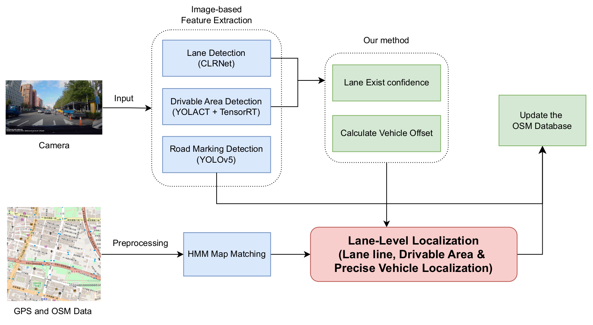
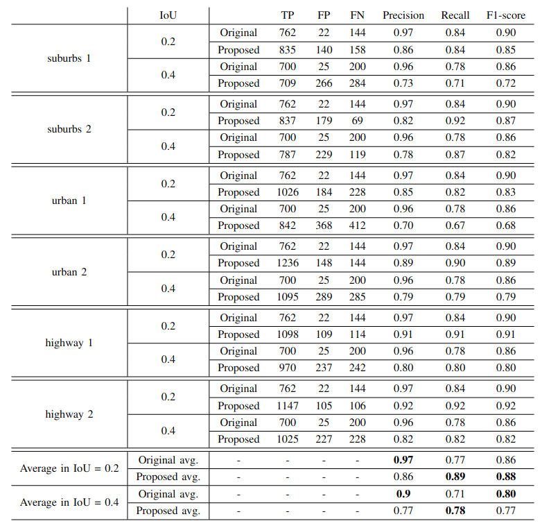

# Improving Vehicle Localization with Lane Marking Detection Based on Visual Perception and Geographic Information

### *Huei-Yung Lin, Jun-Yi Li, Ming-Wei Su*


## Abstract
*This paper proposes a novel vehicle localization method combining drivable area detection, lane line detection, and image map matching to achieve lane-level accuracy. A key innovation is generating virtual lane lines based on confidence, improving lane marking detection and supporting subsequent localization algorithms.The study also integrates traffic light detection and stores their locations in OpenStreetMap (OSM) format, enhancing localization accuracy and environmental perception by incorporating traffic light data. The system updates the map database in real time, ensuring reliable localization. The model was pre-trained on the CULane dataset and fine-tuned with custom data to adapt to diverse road conditions, enhancing localization stability.*

## Pipeline
The proposed method's pipeline comprises four key components: lane marking detection, drivable area detection, vehicle localization, and updates to the OSM database.



## Results in different IoU



## Getting Started
### Requirements
for GPU: Nvidia RTX 3080ti
- Ubuntu 20.04
- Python >= 3.8
- Cuda 11.8
- Pytorch 2.4.1
- TensorRT 8.2.5.1

### Setup environemnt
First create the conda environment:
```
conda create -n py38 python=3.8
```
and activate it with:
```
conda activate py38
```
Install other packages
```
pip install cython numpy PyYAML requests scipy tqdm protobuf osmnx addict yapf mmcv imgaug seaborn
pip install opencv-python pillow matplotlib scikit-learn p_tqdm
pip install git+https://github.com/haotian-liu/cocoapi.git#"egg=pycocotools&subdirectory=PythonAPI"
pip install GitPython termcolor tensorboard
pip install leuvenmapmatching
```
Install torch2trt
```
git clone https://github.com/NVIDIA-AI-IOT/torch2trt
cd torch2trt
python setup.py install --plugins
```
Install CLRNet dependence
```
cd ../CLRNet 
python setup.py build develop
```
### Testing data
Download weights and test data from [here](https://drive.google.com/drive/folders/1TMY9emnEqHV85pAv6ALrabRSt_AUsX6y?usp=sharing).

## File structure
 - Your folder should be organized like this:
  ```
  JunYi_Proj
  ├── map_matching_code
  ├── fake_lane
  ├── utils
  ├── CLRNet
  │   ├── clrnet_lane.pth
  ├── yolact_edge
  │   ├── weights
  │   │   ├── yolact_edge_resnet50_1467_800000.pth
  │   ├── yolact_edge
  │   │   ├── data
  │   │   │   └── calib
  ├── yolov5
  │   └── traffic_light_best.pt
  ├── system.py
  └── test_data
  ```


## Usage
### Run project
```
cd project
python system.py
```
For different images (suburban 220531, urban 201116, highway 160720), the parts that need to be modified are as follows:

- Suburban 220531
```python=
# video name: 220531153103.MOV, 220531153403.MOV
# fake lane: 220531_fake_lane.txt

# line 39
self.lane_cfg = Config.fromfile('./CLRNet/configs/clrnet/clr_resnet34_ceo.py')
# line 42  
self.lane_detect_cut_height = 590
# line 62
self.y_sample = (980, 680, -40)
# line 63 fake lane 
self.fake_lane, self.fake_lane_sample, self.exist_lane_data = create_fake_lane('./fake_lane/220531_fake_lane.txt', self.y_sample) 
# line 66 GPS info
self.gps_data, self.angle_data = readnmea('./test_data/220531/220531153403.NMEA') 
# line 68 video
self.video_path = './test_data/220531/220531153403.MOV'
```
- Urban 201116
```python=
# video name: 201116145511.MOV, 201116145712.MOV
# fake lane: 201116_fake_lane.txt

# line 39
self.lane_cfg = Config.fromfile('./CLRNet/configs/clrnet/clr_resnet34_ceo.py')
# line 42  
self.lane_detect_cut_height = 590
# line 62
self.y_sample = (880, 580, -40)
# line 63 fake lane 
self.fake_lane, self.fake_lane_sample, self.exist_lane_data = create_fake_lane('./fake_lane/220531_fake_lane.txt', self.y_sample) 
# line 66 GPS info
self.gps_data, self.angle_data = readnmea('./test_data/201116/201116145511.NMEA') 
# line 68 video
self.video_path = './test_data/201116/201116145511.MOV'

###!!!!attention!!!!###
when test video is 201116145511.MOV
# line 123
self.gps_count = 4
######################
```
- Highway 160720
```python=
# video name: 140707_cut.mp4, 141713_cut.mp4
# fake lane: 160720_fake_lane.txt

# line 39
self.lane_cfg = Config.fromfile('./CLRNet/configs/clrnet/clr_resnet34_160720.py')
# line 42  
self.lane_detect_cut_height = 400
# line 62
self.y_sample = (780, 420, -20)
# line 63 fake lane 
self.fake_lane, self.fake_lane_sample, self.exist_lane_data = create_fake_lane('./fake_lane/160720_fake_lane.txt', self.y_sample) 
# line 66 GPS info
self.gps_data, self.angle_data = readnmea('./test_data/160720/140707_cut.txt') 
# line 68 video
self.video_path = './test_data/160720/140707_cut.mp4'
# line 203 change lane num
self.lane_num = 3 # default is 0 in project will be considered 2.
```
## Lane line & Localization Validation

for the result of different IoU, you can run this code.
- Lane line accuracy
```
# line 140 image shape
python evaluate_result/caculate_lane_pred.py -p pred_path -t ground_truth_path
```
p.s. you can also change default route at parse_args() in line 225
- Localization accuracy
```
# line 49 ground truth path
# line 51 predict path
python evaluate_result/caculate_gt.py
```

## Acknowledgements
Drivable area detection -> YolactEDGE
github: https://github.com/haotian-liu/yolact_edge
paper: https://arxiv.org/abs/2012.12259

Lane detection -> CLRNet
github: https://github.com/Turoad/CLRNet
paper: https://arxiv.org/abs/2203.10350

Traffic light detection -> Yolov5
github: https://github.com/ultralytics/yolov5
paper: None

Map matching
github: https://github.com/wannesm/LeuvenMapMatching
paper: https://www.ismll.uni-hildesheim.de/lehre/semSpatial-10s/script/6.pdf

We thank these authors for their work.

## Citation
If you find this code helpful for your research, please cite our paper [Improving Vehicle Localization with Lane Marking Detection Based on Visual Perception and Geographic Information](https://ieeexplore.ieee.org/document/10228058).

```
@INPROCEEDINGS{10228058,
  author={Li, Jun-Yi and Lin, Huei-Yung},
  booktitle={2023 IEEE 32nd International Symposium on Industrial Electronics (ISIE)}, 
  title={Improving Vehicle Localization with Lane Marking Detection Based on Visual Perception and Geographic Information}, 
  year={2023},
  volume={},
  number={},
  pages={1-6},
  keywords={Location awareness;Performance evaluation;Industrial electronics;Global navigation satellite system;Databases;Lane detection;Image processing},
  doi={10.1109/ISIE51358.2023.10228058}}
```
